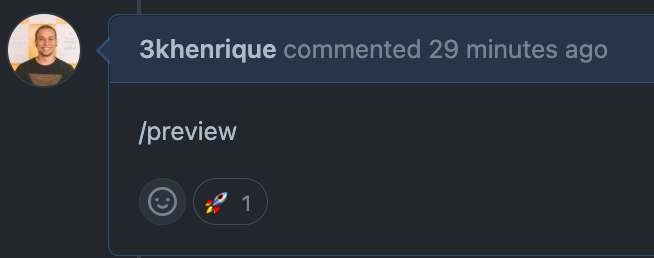
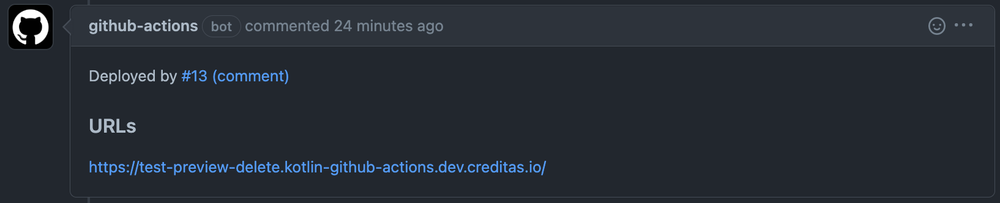

# Kotlin Spring Sample

This is an example API project using Spring in Kotlin that can be used to bootstrap new Kotlin microservices at Creditas.

## Table of contents
- [Bootstrap](#bootstrap)
  - [With Cliditas](#with-cliditas)
  - [With Terraform](#with-terraform)
  - [Configuring a DB](#configuring-a-db)
  - [Running Locally](#running-locally)
  - [Configuring local events](#configuring-local-events)
- [First steps](#first-steps)
- [Architecture](#architecture)
- [Infrastructure](#infrastructure)
- [Authentication](#authentication)
- [Logs (LogEntries)](#logs-logentries)
- [Examples](#examples)


## Bootstrap

> **Note**  
> We strongly recommend that you use this template with `cliditas` to deploy your application, but you can still create your application infrastructure using the [terraform-applications](https://github.com/Creditas/terraform-applications) model

### With cliditas

#### Prerequisites

- You will need to have the latest stable release of [cliditas](https://github.com/Creditas/cliditas) installed.
- You will need your [AWS credentials](https://creditas.atlassian.net/wiki/spaces/DEVOPS/pages/181371733/Primeiro+Acesso+AWS) to execute cliditas commands

> **Warning**  
> Currently, cliditas doesn't support _migration tasks_, this will be implemented in the near future

#### Steps

1. Create a new repository with ["use this template"](https://github.com/Creditas/kotlin-spring-sample/generate) button.

2. Clone the new repository in your machine and run the `rename-project.sh` script:
      ```sh
      ./rename-project.sh app-name
      ```

    where `app-name` is the name of your application.  
    For example: `risk-analysis`.
    > This script will change the namespaces, Docker files, Gradle, database, etc.

3. Setup the environment
      1. Log in to AWS
            ```sh
            aws-vault exec <profile name>
            ```
            > **Note**  
            > If that is your first time in this step, login with your `developer` aws credentials.  
      
      2. Log in to the development Kubernetes cluster
          ```sh
          cliditas login
          ```

4. Initialize the application.  
This will create some necessary resources, like an _ECR repository_, and a _Kubernetes namespace_.
      ```sh
      cliditas init
      ```

### Pipeline
  > this project is running a GitHub Actions pipeline. By default, this pipeline is configured to follow the ["cliditas golden path"](https://github.com/Creditas/cliditas/tree/master/docs/tutorials/golden_path) guideline.

1. If you want to Edit the tests step inside the CI configuration: 
      1. Open `.github/workflows/test.yaml` with ~vim~ your favorite editor, and edit the `test-app` job.  
      This are the predefined `test-app` job and `lint` steps that you can use for this project when using `cliditas`:
            ```yaml
            jobs:
              test-app:
                runs-on: ubuntu-latest
                steps:
                  - uses: actions/checkout@v4
                  - uses: actions/setup-java@v3
                    with:
                      distribution: 'corretto'
                      java-version: '21'
                      cache: 'gradle'
                  - run: gradle test -i
              lint:
                runs-on: ubuntu-latest
                steps:
                  - uses: actions/checkout@v4
                  - run: gradle dependencies
            ```

2. This Pipeline has been configured to deploy your app in all environments (dev, staging, and production) when the PR is merged against the master branch, or a new tag release.


#### Preview environment:
> Preview environment is configured to works only inside a PR scope.


If you want to deploy a preview version of your application, all you need to do is leave a comment `/preview` on the discussion body of your PR, this comment will trigger an action that will deploy your app on a preview environment, when the deploy process starts, the action will let an :rocket: reaction on your comment.


Once you app are successfully deployed on a preview environment, a new comment will be left containing the preview environment URL of your app. 




> By default, all preview deployments are deleted by cliditas garbage collector in the next 3 days.

6. Commit and push all changes.

8. Repeat steps `3` and `4` using your `staging` and `production` aws credentials to initialize your application at this environments (but do **NOT** commit the changes at your deployment pipeline). 
      > **Warning**  
      > If you don't do that for every environment, your build will fail for missing environment

9. For each environment that was set up, it is also necessary to manually set the `SPRING_PROFILES_ACTIVE` SSM parameter:
    ```sh
    $ aws-vault exec <profile name> -- cliditas config set SPRING_PROFILES_ACTIVE <staging|prod>
    ```

10. Follow the [Configuring a DB](#configuring-a-db) section to setup a PostgreSQL or MongoDB

Now your application is ready to be deployed to all environments!

### With Terraform

> **Warning**  
> We just recomend this approach if your application have any requirement that doesn't can be contorned using cliditas


#### Prerequisites
- you must change `Dspring.datasource.url` from `JDBC_DATABASE_URL` to `DATABASE_URL` on `init.sh` if your application is hosted in ECS

#### Steps
1. Create a new repository with ["use this template"](https://github.com/Creditas/kotlin-spring-sample/generate) button.

2. Clone the new repository in your machine and run the `rename-project.sh` script:
      ```sh
      ./rename-project.sh app-name
      ```

    where `app-name` is the name of your application.  
    For example: `risk-analysis`.
    > This script will change the namespaces, Docker files, Gradle, database, etc.

3. To setup your application AWS infrastructure, please read [Terraform Applications](https://github.com/Creditas/terraform-applications).

### Configuring a DB

To configure a DB, merge the branch of the desired database, and that will add the settings needed to each database, with some implementation examples:
- [MongoDB branch](https://github.com/Creditas/kotlin-spring-sample/tree/add-mongodb)
- [PostgreSQL branch](https://github.com/Creditas/kotlin-spring-sample/tree/add-postgresql)

Another point of attention is the fact that `cliditas`, by default, does not configure a DB for the remote environments (stg, prod).  
To fix, that, create and deploy a [DLC](https://github.com/Creditas/cliditas/blob/master/docs/howto/dlc.md) for the desired DB.

You're done, now the DB can be used in remote environments!
      
### Running Locally
      
> **Warning**  
> To build locally, you need to [configure your Artifactory credentials](https://creditas.atlassian.net/wiki/spaces/PROC/pages/135891169/Configurando+uma+depend+ncia+do+Artifactory+no+seu+projeto) in the `~/.gradle/gradle.properties`. _This is not needed for the CI_

#### Prerequisites

* [Docker](https://docs.docker.com/install/)
* [Docker Compose](https://docs.docker.com/compose/install/#install-compose)

#### Steps

1. Running migrations is necessary before running your app for the first time or when new migrations are added:
      ```sh
      docker compose run kotlin-spring-sample migrate
      ```

2. Next, run:
      ```sh
      docker compose up -d
      ```

To check if your application is up, use the health check route: 

`GET` [`http://localhost:8000/health`](http://localhost:8000/health)

### Configuring local events

Merge the branch with the kafka configurations:
- [Kafka events](https://github.com/Creditas/kotlin-spring-sample/tree/add-kafka-events)

Kafka setup:
```sh
docker compose up -d data_platform
```

Clone the [events project](https://github.com/Creditas/events) and run the following commands:

```sh
pip3 install virtualenv
python3 -m virtualenv venv
. venv/bin/activate
pip3 install -r requirements.txt
LOCAL_SCHEMA_REGISTRY=http://localhost:8081 python3 deploy_schema -c deploy_local
```

Then open the address `http://localhost:3030/schema-registry-ui/#/` and verify if your schema is there.
Depending on your local environment, you may need to run the first command with `sudo`
After the first execution, whenever you make changes to your event and send them to Data Platform, just repeat the last line `LOCAL_SCHEMA_REGISTRY=http://localhost:8081 python3 deploy_schema -c deploy_local` to update your local environment.
      

## First Steps

* Local URL: http://localhost:8000
* Staging: http://kotlin-spring-sample.stg.creditas.io
* Prod: http://kotlin-spring-sample.prod.creditas.io
* API documentation (local with Swagger): http://localhost:8000/swagger-ui.html

You can figure the URLs the application is deployed with `cliditas`:
```sh
cliditas urls 
```

### Running tests and lint

It's possible to run commands configured in Gradle (by plugins included in `build.gradle`) to run tasks like test or lint. The command below execute application build, test, and lint:

```sh
./gradlew clean && ./gradlew build && ./gradlew test && ./gradlew detekt
```
This way, before committing, you can check for any possible problems in your change.

To lint (Detekt) inside IntelliJ IDEA, use this plugin: [detekt to IDEA](https://plugins.jetbrains.com/plugin/10761-detekt).

> **Warning**  
> You will need `db` (postgres) service running in your machine to run the sample tests.
      
Some interesting Gradle *targets* (build system):

* `./gradlew dependencies`: Dependencies download
* `./gradlew build`: Full project build (with dependencies download too)
* `./gradlew detekt`: Linter that fixes simple errors and reports syntax problems.

## Architecture

### Used libraries:

* **Gradle**: Build tool and dependency manager. ("Rake" + "Bundler")
* **Spring**: Web framework ("Rails")
* **Spring Data/JPA**: Postgres persistency framework ("Sequel")
* **Flyway**: Postgres migration manager (made with pure SQL)
* **Spring Data/Mongo**: Mongo persistency framework
* **Embed Mongo**: A tool to simulate Mongo at test stack.
* **Kluent**: Fluent assertions
* **Mockito Kotlin**: mockito wrapper with kotlin-friendly syntax
* **Jackson**: JSON serializer/deserializer
* **Logback**: Logs consolidator/formatter to stdout (We redirect these logs to [LogEntries using AWS](https://stackoverflow.com/q/52040329/890890))
* **Swagger**: Automatic API documentation generation tool with UI accessible from http://localhost:8000/swagger-ui.html
* **Actuator**: A tool with monitoring features (used to delivery `/health` route)
* **Datadog**: Error Logs, APM, alerts, monitoring, and more.

### Project layers:
In this sample, all dependencies were placed at root `gradle.build`, and files inside the structure are semantically separated by packages (namespace/path). *To get better-segmented structure in layers, you just need to create Gradle sub-projects (with individual `build.gradle` files) like they did in the [policies project](https://github.com/creditas/policies). The only difference is that in this example, Groovy was used as syntax pattern inside the Gradle file, and here, we are using Kotlin Script for typing purposes, but the syntax is similar*

#### Packages do módulo Web:
* **Controller**: Spring controllers and actions, command triggering, task orchestrations
* **Models**: Representations of project entities
* **Infra**: Issues that involve purely technology (database access, sending emails, calls to external APIs)

## Infrastructure

This projet was made to work with [Cliditas](https://github.com/Creditas/cliditas) or the deprecated [Terraform Applications](https://github.com/Creditas/terraform-applications) module.

Please refer to the [Bootstrap](#bootstrap) section to get better instructions.

## Logs (LogEntries)

The project is pre-configured to use _Rapid7 (former Logentries)_, but, some specific changes are needed in your application so that this integration works. Please see the instructions described [here](https://creditas.atlassian.net/wiki/spaces/PROC/pages/145358928/Configura+o+LogEntries+e+obten+o+de+Token).

## Authentication

### Do I need authentication?
An authentication is necessary whenever you'll expose your application to the external world through our API Gateway. If you're serving only requests to services that are inside our Consul Connect service mesh, you don't need to set up
By identifying in which layer of the platform diagram your service belongs, you'll discover if there is the need of exposing a public API.
Most of our services are inside Creditas the OpenBanking API delimiter, but, we chose to keep the `lib-auth` by default inside kotlin-spring-sample and disable manually if necessary to ensure that no application can be launched without auth by mistake.
In case your service doesn't need auth, the files that should be removed are listed in [this PR](https://github.com/Creditas/kotlin-spring-sample/pull/77/files)


#### References
[Artifactory configuration](https://creditas.atlassian.net/wiki/spaces/PROC/pages/135891169/Configurando+uma+depend+ncia+do+Artifactory+no+seu+projeto)

[Sprint Authentication Lib](https://github.com/Creditas/api-gateway/tree/master/authentication-spring)

[Platform Architecture](https://creditas.atlassian.net/wiki/spaces/PLAT/overview)

## Examples:

 - MongoDB example application with terraform config: https://github.com/Creditas/mongodb-example
